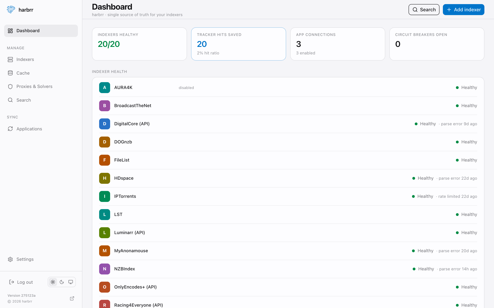
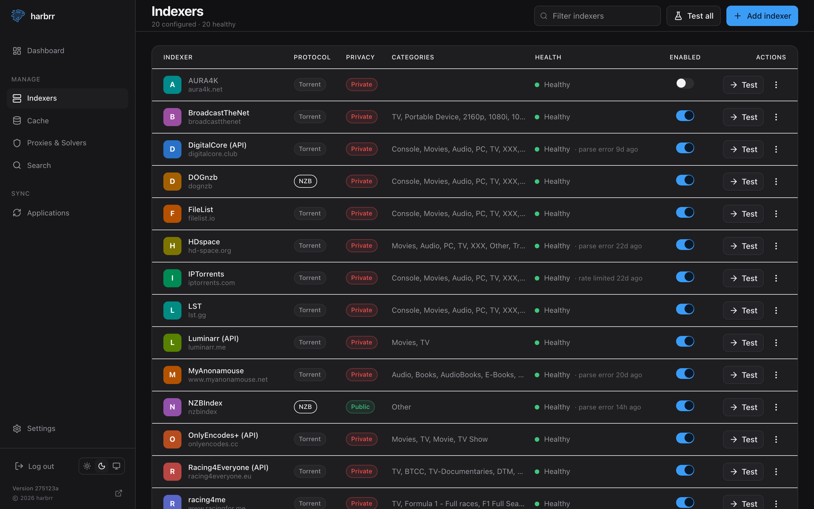
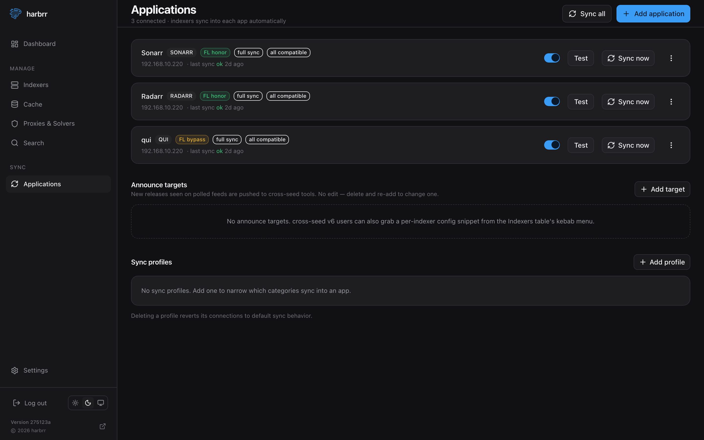

<h1 align="center">
  <picture>
    <source media="(prefers-color-scheme: dark)" srcset=".github/assets/logo-dark.png">
    
  </picture>
  <br/>
  harbrr
</h1>

<p align="center">The tracker and indexer fabric for the autobrr ecosystem — a single-binary, Cardigann-compatible <strong>Torznab/Newznab</strong> provider.</p>

<p align="center">
  <a href="https://github.com/autobrr/harbrr/releases"></a>&nbsp;
  <a href="https://github.com/autobrr/harbrr/releases"></a>&nbsp;
  <a href="https://github.com/autobrr/harbrr/actions/workflows/ci.yml"></a>&nbsp;
  <a href="LICENSE"></a>&nbsp;
  <a href="https://discord.autobrr.com"></a>
</p>

<p align="center">
  <picture>
    <source media="(prefers-color-scheme: dark)" srcset=".github/assets/dashboard-dark.png">
    
  </picture>
</p>

Harbrr is the centralized intelligence layer between your trackers and your automation.
Configure your trackers once, connect everything, and let harbrr aggregate feeds,
deduplicate searches, and be a better private-tracker citizen.

Built for **autobrr, qui, and cross-seed** from day one, while staying fully compatible
with Sonarr, Radarr, Lidarr, Readarr, Mylar, Whisparr, and any Torznab/Newznab client.

> [!NOTE]
> **Alpha.** This first release ships a full **embedded web UI** alongside the engine and
> daemon. The Cardigann engine is at parity with Jackett/Prowlarr (proven offline and live),
> native drivers cover the trackers Cardigann can't express, and harbrr syncs indexers into
> Sonarr/Radarr/qui. Expect rough edges and breaking changes before `v1.0` — and **back up your
> `/config` directory** (SQLite DB + encryption keyfile). The interactive **Swagger UI at
> `/api/docs`** remains available as the full API surface.

---

## Features

- **Centralized tracker management** — one source of truth for auth, capabilities, categories,
  and search behavior across your whole stack. No duplicating tracker setup per app.
- **Full Torznab/Newznab** — works with autobrr, qui, cross-seed, and the entire \*arr family
  (Sonarr, Radarr, Lidarr, Readarr, Mylar, Whisparr).
- **Cardigann compatibility** — reuses the mature Jackett/Prowlarr definition ecosystem with a
  modernized execution engine, plus **native drivers** for trackers Cardigann can't express.
- **App-sync** — push your indexers into Sonarr/Radarr/qui automatically, with configurable
  sync profiles (category narrowing, min seeders, per-capability search toggles).
- **Shared RSS + search-results cache** — many consumers, one upstream request; far fewer
  tracker queries, lower latency, better tracker citizenship. Circuit breakers keep a flaky
  tracker from taking down a search.
- **Cross-seed aware** — freeleech-aware matching, optional freeleech-bypass, and cross-seed
  announce targets.
- **Secure by default** — credentials encrypted at rest, secrets redacted everywhere, and
  offline key rotation for stored secrets.
- **Modern Go** — a single static binary for Linux, macOS, Windows and FreeBSD (or Docker); low footprint, fast startup.

More detail on each lives in the **[feature docs](website/docs/features/)**.

---

## Screenshots

Everything harbrr does is available from the embedded management UI — and every action is also
an HTTP endpoint (the **Swagger UI at `/api/docs`** is the full API reference). Light and dark
themes included.

<table>
  <tr>
    <td width="50%"></td>
    <td width="50%"></td>
  </tr>
  <tr>
    <td align="center"><em>Indexers — add, test, enable/disable, filter</em></td>
    <td align="center"><em>Applications — sync indexers into Sonarr/Radarr/qui</em></td>
  </tr>
</table>

---

## Installation

harbrr listens on port **7478** and stores its SQLite database + encryption keyfile in a single
data directory. Once it's up, open the web UI, create the admin, mint a Torznab key, add an
indexer, and point your apps at the feed — see **[Getting started](website/docs/getting-started.md)**
for the full walkthrough.

### Docker (compose)

```yaml
# docker-compose.yml — a ready-to-edit docker-compose.example.yml ships in the repo
services:
  harbrr:
    image: ghcr.io/autobrr/harbrr:latest
    container_name: harbrr
    restart: unless-stopped
    # Run as the uid:gid that owns ./config so the bind mount is writable.
    # Find yours with `id`; the image itself defaults to 1000:1000.
    user: "1000:1000"
    ports:
      - "7478:7478"
    volumes:
      - ./config:/config           # bind mount — SQLite db + encryption keyfile; BACK THIS UP
    environment:
      - TZ=Etc/UTC                 # match your stack so localized tracker dates parse
```

```bash
docker compose up -d
# open http://<host>:7478
```

### Docker (run)

```bash
docker run -d \
  --name harbrr \
  -p 7478:7478 \
  --user 1000:1000 \
  -v "$(pwd)/config:/config" \
  ghcr.io/autobrr/harbrr:latest
```

The image runs non-root, exposes port 7478, ships a `/healthz` check, and already invokes
`harbrr serve --host 0.0.0.0 --data-dir /config`.

> [!NOTE]
> `:latest` is published only for **stable** releases. During alpha (pre-releases) it won't
> exist — pull the version tag instead, e.g. `ghcr.io/autobrr/harbrr:0.1.0-alpha` (no `v`
> prefix). This applies to both the compose and run examples above.

### Linux / macOS / Windows / FreeBSD (prebuilt binary)

Grab the archive for your platform from
[Releases](https://github.com/autobrr/harbrr/releases) (Linux, macOS, Windows and FreeBSD across
amd64 / arm / arm64):

```bash
# download + extract the newest linux x86_64 build (works for pre-releases too)
wget $(curl -s https://api.github.com/repos/autobrr/harbrr/releases \
  | grep browser_download_url | grep linux_x86_64 | head -n1 | cut -d\" -f4)
tar -C /usr/local/bin -xzf harbrr*.tar.gz

harbrr serve --data-dir ~/.config/harbrr   # open http://localhost:7478
```

> [!NOTE]
> During alpha, releases are published as **pre-releases**, so `/releases/latest` (which only
> returns stable releases) won't find them — the command above lists all releases and takes the
> newest asset. You can also just download from the [Releases page](https://github.com/autobrr/harbrr/releases).

### Build from source

```bash
git clone https://github.com/autobrr/harbrr && cd harbrr
make web-build                               # builds the SPA (needs Node + pnpm)
make build                                   # -> bin/harbrr (embeds web/dist)
./bin/harbrr serve --data-dir ./data         # open http://localhost:7478
```

> [!NOTE]
> `make build` embeds whatever is in `web/dist`; a fresh checkout has none, so run
> `make web-build` first — otherwise the binary serves "frontend not built". Published images
> and release archives already bundle the UI.

### First run

1. Open **`http://<host>:7478`** and create the admin account.
2. **Settings → API keys** — mint a Torznab/Newznab key (shown once).
3. **Indexers → Add indexer** — pick a definition and enter credentials (encrypted at rest).
4. Point Sonarr/Radarr at a **Generic Torznab** indexer, or connect them from **Applications**
   to have harbrr sync your indexers automatically:
   - URL: `http://harbrr:7478/api/indexers/<slug>/results/torznab`
   - API key: the key minted in step 2

---

## Status & testing

harbrr is **alpha**, but the engine is heavily validated. It ships **575 trackers** — 556 from
the embedded Cardigann corpus plus 24 native drivers (with **19 more native drivers planned**) —
and every shipped tracker passes its **offline golden tests**. Live validation against real
trackers and a real \*arr stack is tracked separately:

- **[Tracker coverage](website/docs/coverage.md)** — the per-tracker Built / Live-tested matrix.
- **[Test status](website/docs/test-status.md)** — the evidence: Prowlarr differentials, real
  grabs, and which auth/fetch patterns are proven live.

**Proven live:** API-key trackers (UNIT3D & friends), user/pass form login, Cloudflare via
FlareSolverr, and server-side grabs (`/dl`) for both cookie- and header-auth trackers.
BroadcastTheNet, IPTorrents, FileList, MyAnonamouse, NZBIndex and generic Newznab/Usenet are
live-confirmed.

**Not yet proven / not working:**

- **Send-to-download-client** is not implemented — harbrr resolves download links; handing a
  release to a client is planned ([#8](https://github.com/autobrr/harbrr/issues/8)).
- Cookie/manual-cookie definitions, non-Latin / `regexp2` trackers, and per-indexer proxies are
  offline-gated but **not yet live-tested** (waiting on a qualifying account/environment).
- Most native drivers (AvistaZ family, HDBits, BeyondHD, Redacted/Orpheus/AlphaRatio,
  PassThePopcorn, …)
  are built and offline-gated, **pending credentials** for a live pass.
- **Postgres** is deferred — SQLite only for now.

Running the live smoke harness yourself (build-tagged, env-credentialed, and **never run in CI**)
is one of the most useful contributions right now — see the **[smoke ledger](internal/smoke/README.md)**
and the **[smoke-test guide](website/docs/guides/smoke-test.md)**. Release-by-release changes are
in **[CHANGELOG.md](CHANGELOG.md)**.

---

## Security

Tracker credentials are **encrypted at rest** (AES-256-GCM), the admin password and API keys are
**hashed**, and secrets are **redacted** from logs, errors and traces — a passkey never appears
in the served feed (download links resolve server-side). See
**[docs/security.md](docs/security.md)** for the model and **[SECURITY.md](SECURITY.md)** to
report a vulnerability privately.

## Contributing & community

Contributions, testing, and feedback are welcome — especially Cardigann definitions, tracker
testing, and autobrr/qui/cross-seed integration. Start with **[CONTRIBUTING.md](CONTRIBUTING.md)**
and the **[Code of Conduct](CODE_OF_CONDUCT.md)**, and join us on
**[Discord](https://discord.autobrr.com)**.

## License

harbrr is free software, released under the **GNU General Public License, version 2 or later
(GPL-2.0-or-later)**. The full text is in [LICENSE](LICENSE).

---

## Keywords

autobrr, qui, cross-seed, Torznab, Newznab, Cardigann, Prowlarr alternative, Jackett
alternative, private trackers, RSS caching, search deduplication, indexer manager, indexer
proxy, Sonarr, Radarr, Lidarr, Readarr, Mylar, Whisparr, Go, Docker
